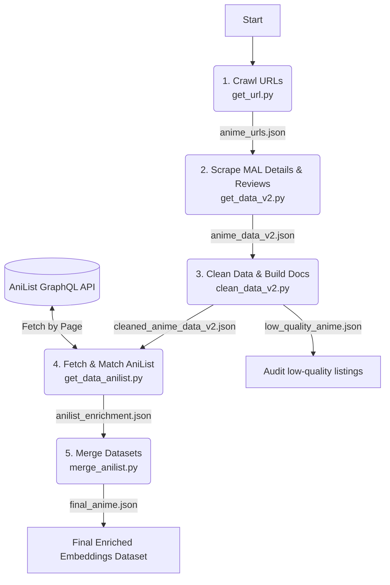

# MyAnimeList & AniList Data Pipeline

This repository contains a multi-stage Python data pipeline designed to scrape, clean, enrich, and format anime information from MyAnimeList (MAL) and AniList. The final output is structured as embed-ready documents (containing clean text content and extensive metadata) optimized for semantic search, vector databases, and Retrieval-Augmented Generation (RAG) applications.

The resulting dataset generated from this pipeline is hosted on Kaggle:
👉 **[MyAnimeList 2026 Data on Kaggle](https://www.kaggle.com/datasets/minhduc1212/myanimelist-2026-data)**

---

## 🏗️ Repository Architecture

Below is the directory structure of the repository:

```text
MyAnimeList_Data/
├── .antigravitycli/           # CLI tool configurations
├── .git/                      # Git repository files
├── .venv/                     # Python virtual environment
├── README.md                  # Project documentation (this file)
├── requirements.txt           # Project dependencies
├── plan.md                    # Project execution notes and targets
├── scraper.log                # Scraping logs for MAL scraper V2
├── fetch_anilist_v2.log       # Log file for AniList crawler
├── anilist_page_checkpoint.txt# Resume checkpoint page number for AniList
│
│   # --- Raw & Intermediate Data Files ---
├── anime_urls.json            # Scraped unique anime URLs from MAL
├── anime_data_v2.json         # Raw scraped anime details, reviews, and recs (MAL)
├── cleaned_anime_data_v2.json # Cleaned, filtered, and formatted MAL documents
├── low_quality_anime.json     # Skipped low-quality MAL entries (no synopsis/reviews/recs)
├── anilist_data_raw.json      # Raw cached dump of the AniList database
├── anilist_enrichment.json    # Matched AniList tags & recommendations mapped to MAL URLs
├── final_anime.json           # Final combined dataset (MAL + AniList) ready for embedding
│
│   # --- Main (V2) Pipeline Scripts ---
├── get_url.py                 # Multi-threaded MAL URL crawler
├── get_data_v2.py             # Multi-threaded MAL details, reviews, and recs scraper
├── clean_data_v2.py           # Data cleaning, sanitization, and document formatter
├── get_data_anilist.py        # GraphQL fetcher & similarity matcher for AniList
├── merge_anilist.py           # Merges AniList enrichment data into the final dataset
│
│   # --- Legacy (V1) Pipeline ---
└── prepare_data_v1/           # Deprecated legacy code and data
    ├── all_anime_data.json    # Legacy raw data
    ├── anime_urls.json        # Legacy URLs list
    ├── crawler_progress.json  # Legacy URL crawling progress tracker
    ├── get_url.py             # Legacy URL crawler
    ├── get_data.py            # Legacy details scraper
    └── clean_data.py          # Legacy data cleaning script
```

---

## 🔄 Data Pipeline Workflow

The modern pipeline runs sequentially in five steps:



---

## 🛠️ Step-by-Step Pipeline Guide

### Step 1: Collect Anime URLs
Crawls the alphabet-based directories on MyAnimeList to harvest individual anime page URLs.
* **Script:** [get_url.py](file:///D:/LT/MyAnimeList_Data/get_url.py)
* **Command:**
  ```bash
  python get_url.py
  ```
* **Mechanics:**
  * Runs a `ThreadPoolExecutor` with 5 concurrent workers.
  * Loops over letters `.` and `A` to `Z` targeting `https://myanimelist.net/anime.php?letter={letter}&show={show}`.
  * Extracts URLs starting with `https://myanimelist.net/anime/`.
  * Track progress incrementally in `crawler_progress.json` and outputs unique URLs to `anime_urls.json`. Supports safe pausing and resuming.

### Step 2: Scrape Raw Anime Details & Reviews (MAL)
Extracts anime attributes, user reviews, and user recommendation relationships.
* **Script:** [get_data_v2.py](file:///D:/LT/MyAnimeList_Data/get_data_v2.py)
* **Command:**
  ```bash
  python get_data_v2.py
  ```
* **Mechanics:**
  * Reads `anime_urls.json`.
  * Uses 5 worker threads via `ThreadPoolExecutor` to fetch pages.
  * Scrapes key attributes (Title, Synopsis, Score, Rank, Popularity, Members, Studios, Genres, Themes, Demographics, etc.).
  * Performs secondary requests to `<anime_url>/reviews?spoiler=on&sort=suggested` (captures top 5 reviews) and `<anime_url>/userrecs` (captures up to 10 recommended titles).
  * Automatically saves database progress every 10 fetches and logs detailed status reports to `scraper.log`. Outputs to `anime_data_v2.json`.

### Step 3: Clean, Sanitize, and Format Documents
Filters out low-quality listings and sanitizes messy scraped text.
* **Script:** [clean_data_v2.py](file:///D:/LT/MyAnimeList_Data/clean_data_v2.py)
* **Command:**
  ```bash
  python clean_data_v2.py
  ```
* **Mechanics:**
  * Discards "low-quality" anime (defined as entries with no synopsis, no reviews, AND no recommendations) and writes them to `low_quality_anime.json` for review.
  * Standardizes missing or corrupted scores (e.g. converting `"N/A1 (scored by...)"` or `"N/A"` to `None`).
  * Fixes double genre string repetitions (e.g. `"FantasyFantasy"` to `"Fantasy"`).
  * Truncates long reviews to a maximum of 400 characters and removes non-ASCII letters from reviews to prevent vector embedding noise.
  * Builds two key fields for each document:
    * `page_content`: A descriptive text block containing fields like title, genres, studios, similarity targets, synopsis, and review summaries, formatted for embedding.
    * `metadata`: Structured fields (e.g., score, popularity, episodes) for metadata filtering in vector databases.
  * Outputs the formatted entries to `cleaned_anime_data_v2.json`.

### Step 4: Fetch and Match AniList Catalogue
Fetches tag metadata from the AniList database to enrich the MAL records.
* **Script:** [get_data_anilist.py](file:///D:/LT/MyAnimeList_Data/get_data_anilist.py)
* **Command:**
  ```bash
  python get_data_anilist.py
  ```
  *(Options: `--step 1` to only download the AniList catalogue, `--step 2` to only run similarity matching on already downloaded data).*
* **Mechanics:**
  * **Fetch Step:** Paginated GraphQL requests to `https://graphql.anilist.co` (50 items/page). Collects IDs, titles (Romaji, English, Native), tags (excluding spoilers, filtering rank $\ge 60\%$), and AniList recommendations. Saves local progress dynamically in `anilist_data_raw.json` and checkpoints to `anilist_page_checkpoint.txt`.
  * **Match Step:** For each AniList entry, it computes string similarity against MAL candidates. It uses a custom Jaccard token overlap similarity with substring bonus (eliminating the need for external heavy fuzzy matching libraries) to compare all alternate titles. If the similarity score is above the threshold (default `0.60`), the data is mapped to the corresponding MAL URL.
  * Outputs mappings to `anilist_enrichment.json`.

### Step 5: Merge Enriched Data into Final Output
Merges the AniList tags and recommendations into the structured MAL document structure.
* **Script:** [merge_anilist.py](file:///D:/LT/MyAnimeList_Data/merge_anilist.py)
* **Command:**
  ```bash
  python merge_anilist.py
  ```
* **Mechanics:**
  * Combines `cleaned_anime_data_v2.json` and `anilist_enrichment.json`.
  * Appends AniList tag lists (`tags: ...`) and recommendation titles (`anilist_recs: ...`) directly inside the text search `page_content` block right under the genre declarations.
  * Updates metadata with `anilist_id`, `anilist_tags`, and `anilist_recs`.
  * Saves the final merged dataset to `final_anime.json`, ready for ingestion by embedding models (such as OpenAI `text-embedding-3-small` or local HuggingFace models).

---

## 📝 Key Code Components & Functions

### Multi-Threaded URL Crawling & Safe Locking
To avoid corrupted JSON files when multiple threads update the progress simultaneously, the scripts use a global `threading.Lock()` to manage read/write access to state files.
* **Key Function:** [process_letter](file:///D:/LT/MyAnimeList_Data/get_url.py#L72) orchestrates letters individually, while holding a lock [file_lock](file:///D:/LT/MyAnimeList_Data/get_url.py#L13) when modifying state variables.

### Beautiful Soup Data Extractors
* **Key Function:** [parse_anime_data](file:///D:/LT/MyAnimeList_Data/get_data_v2.py#L79) handles nested sidebar divs by selecting elements and extracting them. It dynamically identifies comma-separated list blocks (producers, studios, demographics, genres) and filters out placeholder elements.

### Jaccard Token Overlap Matcher
Since external dependencies are kept minimal, the AniList-to-MAL matching relies on an efficient custom Jaccard similarity scorer.
* **Key Function:** [title_similarity](file:///D:/LT/MyAnimeList_Data/get_data_anilist.py#L203):
  1. Normalizes strings by converting to lowercase, stripping accents/diacritics, and removing non-alphanumeric characters.
  2. Discards noise words (`the`, `a`, `an`, `of`, `in`, `to`, `no`, `wa`, `ga`, `wo`).
  3. Calculates the intersection-over-union of word tokens.
  4. Awards a `0.2` bonus if one title is a substring of the other to resolve partial title matches.

### Document Output Format
The resulting output document structure inside [final_anime.json](file:///D:/LT/MyAnimeList_Data/final_anime.json) follows this schema:
```json
{
  "page_content": "title: Texhnolyze\nalt_titles: Techonoraizu | Texhnolyze | テクノライズ\ngenres: Action, Sci-Fi, Suspense | Avant Garde, Cyberpunk, Psychological\ntags: Cyberpunk, Sci-Fi, Psychological, Dystopian, Violence, Philosophy\nanilist_recs: Serial Experiments Lain, Ergo Proxy, Haibane Renmei\ntype: TV | episodes: 22 | demographic: Seinen\nscore: 7.78 | premiered: Spring 2003 | studio: Madhouse | source: Original\nsimilar_to: Serial Experiments Lain, Haibane Renmei, Ergo Proxy, Shinsekai yori\nsynopsis: Texhnolyze is a dark, visceral animation set in the underground city of Lux...\nreview_1: An absolute masterpiece of cyberpunk media. The atmosphere is heavy...",
  "metadata": {
    "url": "https://myanimelist.net/anime/26/Texhnolyze",
    "title": "Texhnolyze",
    "type": "TV",
    "episodes": 22,
    "status": "Finished Airing",
    "score": 7.78,
    "ranked": 967,
    "popularity": 1342,
    "members": 165402,
    "favorites": 3481,
    "genres": "Action, Sci-Fi, Suspense | Avant Garde, Cyberpunk, Psychological",
    "studios": "Madhouse",
    "source": "Original",
    "premiered": "Spring 2003",
    "rating": "R+ - Mild Nudity",
    "duration": "24 min. per ep.",
    "demographic": "Seinen",
    "similar_to": "Serial Experiments Lain, Haibane Renmei, Ergo Proxy, Shinsekai yori",
    "has_reviews": true,
    "review_count": 5,
    "has_synopsis": true,
    "anilist_id": 26,
    "anilist_tags": "Cyberpunk, Sci-Fi, Psychological, Dystopian, Violence, Philosophy",
    "anilist_recs": "Serial Experiments Lain, Ergo Proxy, Haibane Renmei"
  }
}
```

---

## 🕰️ Legacy Pipeline (V1)

For reference, the older pipeline is stored inside [prepare_data_v1](file:///D:/LT/MyAnimeList_Data/prepare_data_v1). 
* **Key script:** [clean_data.py](file:///D:/LT/MyAnimeList_Data/prepare_data_v1/clean_data.py)
* **Main differences in V1:**
  * Simpler single-page details crawler (did not extract reviews or recommendations).
  * Lacked integration with AniList (no tag enrichments).
  * Simpler cleaning logic.
